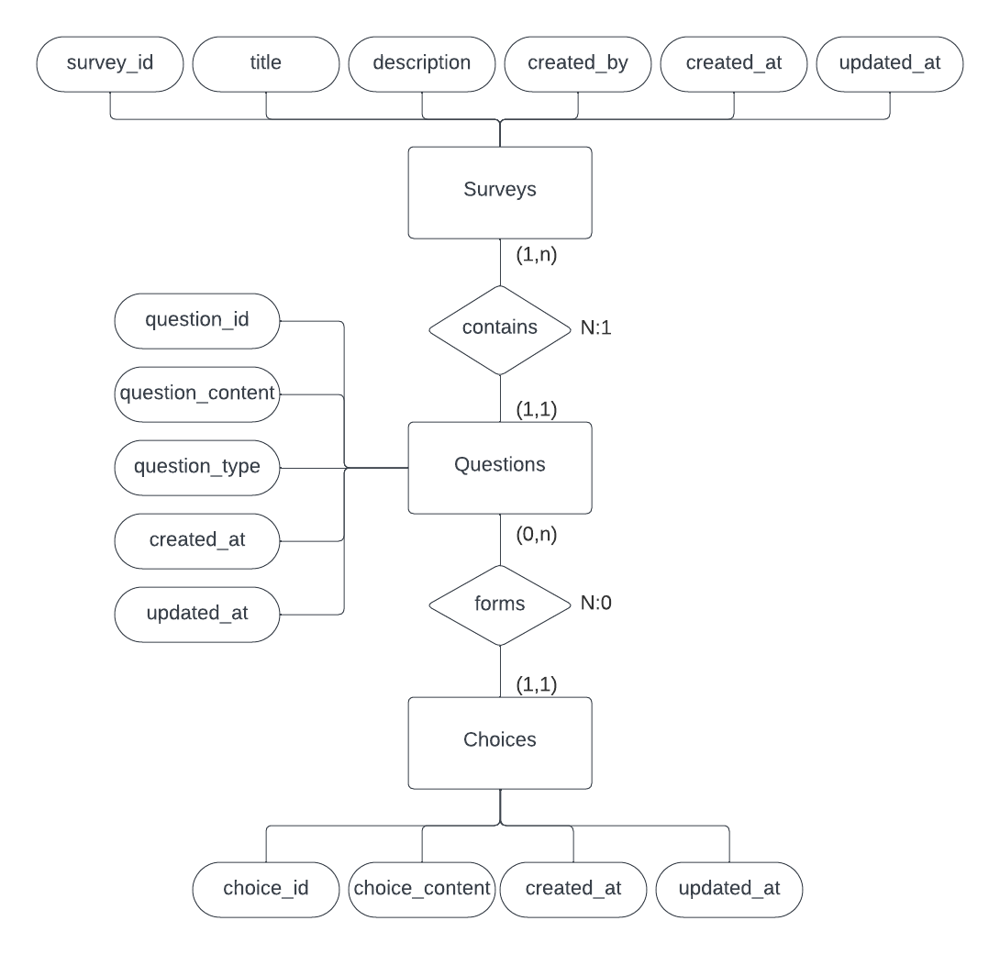
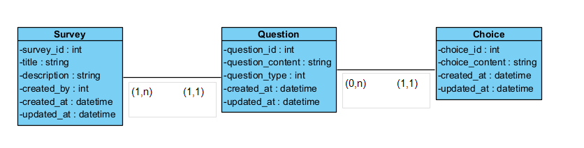

# SurvwayProject

## Table of Contents
- [Introduction](#introduction)
- [Project Origin](#project-origin)
- [Data Model Diagram](#data-model-diagram)
- [User Requirements](#user-requirements)
- [Use Cases](#use-cases)
- [Interfaces and Usability](#interfaces-and-usability)
- [Manuals](#manuals)
- [Technology Stack](#technology-stack)
- [Repositories](#repositories)
- [Planning](#planning)
- [Conclusions](#conclusions)
- [Links and References](#links-and-references)
- [Annexes](#annexes)

## Instructions to Start the Project

This project consists of two main parts: the backend and the frontend. Below are the steps to start each of them.

### Start the Backend

1. Open the Ubuntu terminal in Windows Subsystem for Linux (WSL).
2. Navigate to the project location and enter the backend folder using the `cd` command:

    ```bash
    cd path/to/your/project/survwayProject/backend
    ```
3. Start the PostgreSQL database service:

    ```bash
    sudo service postgresql start
    ```
4. Start the Rails server:

    ```bash
    rails s
    ```

### Start the Frontend

1. Open the project with an IDE, such as Visual Studio Code.
2. Open a terminal within the IDE (e.g., GitBash).
3. Navigate to the frontend folder using the `cd` command:

    ```bash
    cd path/to/your/project/survwayProject/frontend
    ```
4. Start the React server:

    ```bash
    npm start
    ```

## Introduction and Project Origin

Survway is defined as the style we have found when developing a survey creator.

This project arises in response to the intention of creating an easy, fast, and effective tool with the aim of creating surveys, so that any type of user can enter their survey data and produce them in an aesthetic way.


## Use Cases

Here we describe the fundamental interactions with our system. For a more intuitive understanding, we include visual elements.

## ERD



## Relational Model


## Relational Model




## Interfaces and Usability

The initial design, focused on usability, includes mockups and prototypes. After development, we provide a list with demonstrative images that apply the selected usability principles.

## Technology Stack

I've been using ReactJS (TypeScript) for the Frontend and Ruby On Rails for my Backend. ActiveRecord is the ORM used on Survway

## Technology Comparison

The technology stack used in SurvwayProject has been compared with other popular technologies, including Spring Boot, Maven, MongoDB, Vue.js, Angular, Ionic, and Sequelize. While no direct comparison has been made within this project's documentation, it's worth noting the comfortable development environment provided by Ruby on Rails (RoR), especially for developers tackling their first RoR application.

SurvwayProject is a survey creator application aiming to provide an easy, fast, and effective tool for users to create surveys. When considering the advantages and disadvantages of different types of applications like Progressive Web Apps (PWAs), Native apps, and Hybrid apps, each has its own set of characteristics:

- **PWAs (Progressive Web Apps)**:
  - *Advantages*: 
    - Cross-platform compatibility, accessible via web browsers.
    - No need for installation, reducing friction for users.
    - Can work offline or with limited network connectivity.
  - *Disadvantages*:
    - Limited access to device features compared to native apps.
    - Performance may not match that of native apps for complex functionalities.

- **Native Apps**:
  - *Advantages*:
    - Access to full device capabilities, providing a rich user experience.
    - Superior performance, especially for graphics-intensive applications.
  - *Disadvantages*:
    - Requires separate development for each platform (iOS, Android).
    - Higher development costs and longer development time.

- **Hybrid Apps**:
  - *Advantages*:
    - Single codebase for multiple platforms, reducing development time.
    - Easier maintenance compared to separate native apps.
  - *Disadvantages*:
    - May not fully leverage platform-specific features.
    - Performance may be slower compared to native apps.

In the context of SurvwayProject, the choice of technology stack, including RoR for backend development and ReactJS for frontend, offers a balance between ease of development, performance, and accessibility. The familiarity of RoR for backend development, despite being the first time for many developers, contributes to a comfortable development experience. Additionally, leveraging ReactJS for the frontend ensures a responsive and dynamic user interface.


## Conclusions

Working on this proyect was definitely a challenge. A great challenge I could face in the best way of learning new ways of programming with React and being "forced" to discover Ruby on Rails was a great oportunity.

